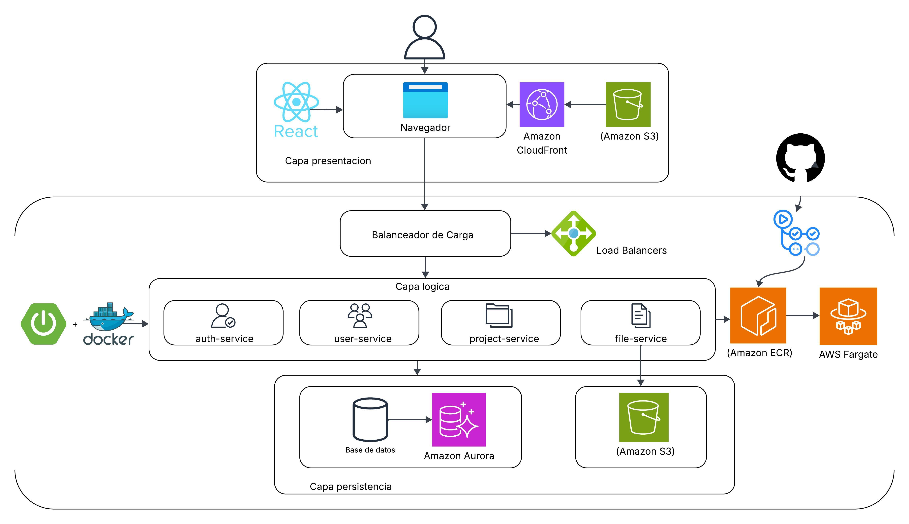
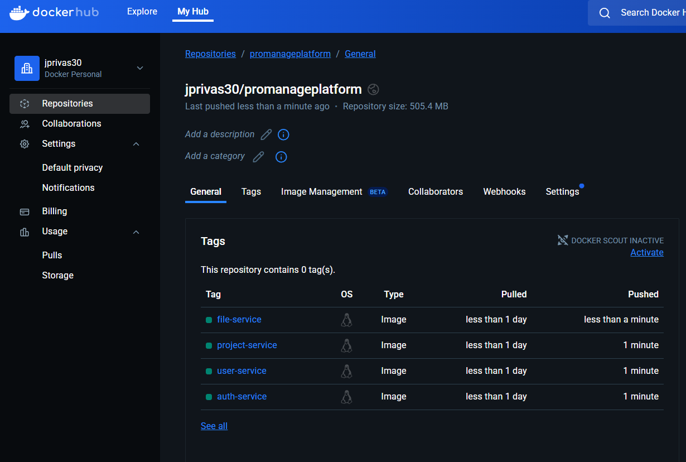
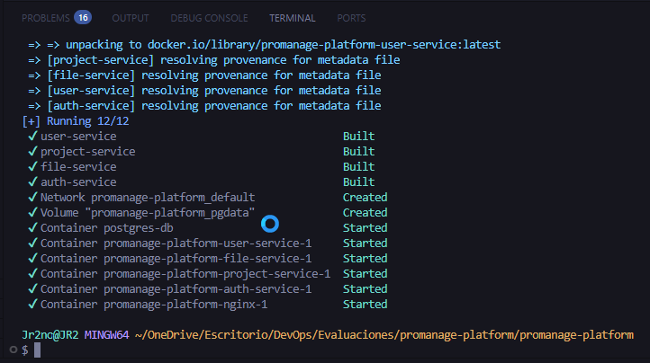

# ProManage - Plataforma de Gestión de Proyectos

**ProManage** es una plataforma de gestión de proyectos basada en microservicios, diseñada para ser modular, escalable, resiliente y fácilmente desplegable en entornos cloud.

## 🧩 Arquitectura

El sistema está dividido en los siguientes componentes:

### 🖥️ Frontend
- **ReactJS**: Interfaz de usuario moderna y desacoplada.
- **Despliegue**: AWS S3 + Amazon CloudFront (CDN).

### 🧠 Backend (Microservicios - Spring Boot)
- auth-service`: Gestión de autenticación y generación de tokens JWT.
- user-service`: Gestión CRUD de usuarios.
- project-service`: Gestión de proyectos.
- file-service`: Almacenamiento y recuperación de archivos.
- **Gateway/API Gateway**: NGINX como proxy inverso y balanceador de carga.
- **Base de datos**: PostgreSQL (en local) o Amazon Aurora (producción).
- **Almacenamiento**: Amazon S3 para archivos adjuntos.

## ☁️ Infraestructura Cloud

| Servicio         | Tecnología               | Justificación |
|------------------|--------------------------|---------------|
| Contenedores     | Docker                   | Empaquetado por microservicio |
| Orquestación     | Docker Compose (local) ECS Fargate (producción) | Simplicidad local, escalabilidad cloud |
| Imágenes         | Docker Hub (desarrollo) AWS ECR (producción) | Registro seguro e integrado |
| CI/CD            | GitHub Actions           | Automatización de build, test y deploy |
| Balanceador      | AWS ALB + NGINX          | Balanceo de carga y routing inteligente |
| DB               | PostgreSQL / Amazon Aurora | Persistencia relacional |
| Almacenamiento   | AWS S3                   | Archivos adjuntos BaaS |
| CDN              | Amazon CloudFront        | Distribución del frontend ReactJS |

## 🧠 Justificación Arquitectónica

- Microservicios para aislar fallos, facilitar despliegues independientes y escalar según demanda.
- Docker + ECS Fargate: portabilidad + gestión serverless de contenedores.
- CloudFront + S3: despliegue global del frontend con bajo costo y gran rendimiento.
- NGINX como gateway: centraliza rutas, facilita la seguridad y permite balanceo.
- GitHub Actions: CI/CD automatizado con YAML e integración natural al repositorio.

## 📊 Diagrama de Arquitectura

## 🛠️ Tecnologías Utilizadas

- Java 21 / Spring Boot / Spring Security
- PostgreSQL / Amazon Aurora
- Docker / Docker Compose
- AWS ECS Fargate / ECR / S3 / CloudFront / ALB
- GitHub Actions
- ReactJS

### Dockerhub

### Build Docker Image

